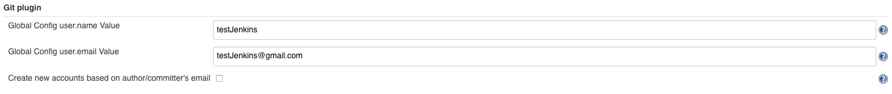
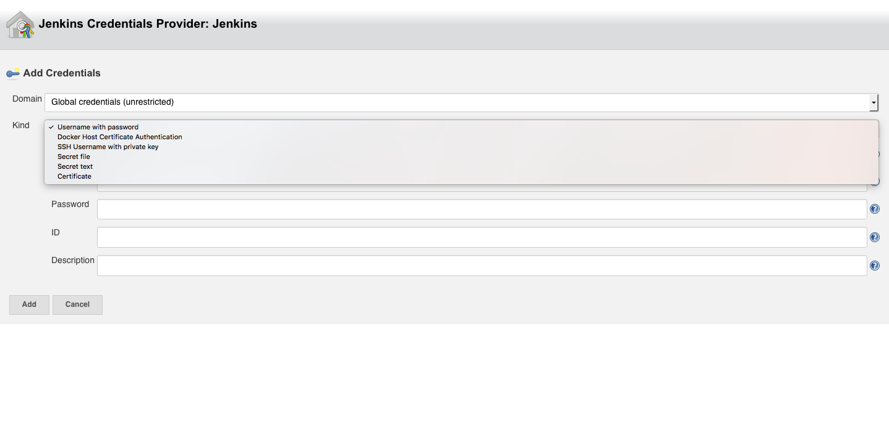
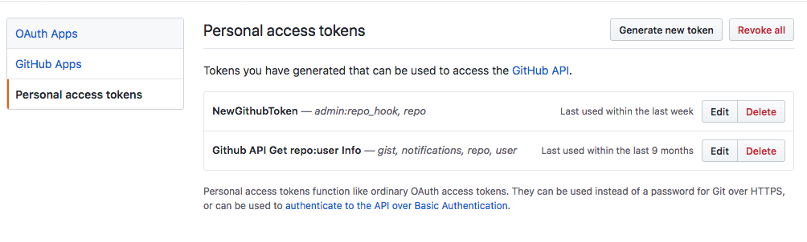

# Continuous Integration with Jenkins and Github

## Intro
> Continuous Integration doesn’t get rid of bugs, but it does make them dramatically easier to find and remove. 
>> Martin Fowler

CI 툴을 이용한다는 것은 위 인용한 글 처럼, **손 쉽게 버그를 찾고 제거하기 위함일 것입니다.** 현재 지그재그도 Jenkins를 이용하여 CI를 운영하고 있으며, 최근에는 Storybook으로 UI를 테스트할 수 있는 시스템을 추가하였습니다. 지그재그는 자동화 CI 시스템을 지속적으로 확대할 계획입니다. 

## 주제
이번 포스트에서는 Jenkins와 Github 연결하는 방법을 알아보고 간단히 테스트하는 예제를 다룰 예정입니다.

#### 목표
1. CI와 CD의 차이점을 이해한다.
2. Jenkins와 Git(Github)를 연결하는 이유를 이해한다.
3. UI(Freestyle)방식과 새로운 Pipeline 방식의 차이를 이해한다.

#### 목록
1. CI란 무엇인가?
2. Jenkins란?
3. Jenkins 설치
4. Jenkins 기본 설정
5. 새로운 Item(Job) 만들기
6. Jenkins와 Github 연결하기
7. Jenkins, Github에 인증하기
8. 기타 및 추가사항

## 필요사항
- Ubuntu 16.04
	- 다른 운영체제도 상관없지만 이번 포스트 내용은 Ubuntu 16.04를 기준으로 작성되었습니다.
- Java 8
- Git
- Jenkins

## 내용


## 1. CI란 무엇인가?(Continuous Integrate)
- Continuous Integrate, Continuous Delivery, Continuous Deploy

<sub>
	CI(Integrate)와 CD(Delivery), CD(Deploy) 차이
	
</sub>

위 그림을 통해 이번 포스트와 가장 연관된 부분은 `Code`, `Build`, `Integrate` 부분입니다. 요즘 대부분이 Git(Github)을 통해 코드 버전관리를 하고 있습니다. 코드를 작성하고, 버전관리하는 작업들은 `Code`, `Integrate`에 해당되는 내용입니다. 엄밀히 보면 `Build`, `Test`, `Release`, `Deploy` 과정이 Jenkins가 담당할 수 있는 부분인 것이죠.

즉, Jenkins와 Git(Github)를 연결하는 방법에 대해 설명한다는 것은 `Code`, `Build`, `Integrate` 과정을 설명하는 것과 같습니다. 빌드 후 테스트까지 처리한다면 `Test`까지 추가되어 완벽한 CI를 구성 할수 있습니다. 간단히 CI와 Jenkins를 이해하기위해 Github와 Jenkins의 연결방법을 주제로 선정했습니다.

## 2. Jenkins란?
- Jenkins는 2004년에 썬 마이크로시스템즈에서 시작된 소프트웨어이며, 지속적인 통합과 테스트를 위해 Kawaguchi Kohsuke에 의해 만들어졌습니다. 처음 이름은 Hudson이지만, 이후 분기되어 현재는 Jenkins라는 이름으로 오픈소스 프로젝트로 관리되고 있습니다.
- Jenkins는 개발 작업을 자동화할 뿐 아니라, 파이프라인(Pipeline)을 사용해 거의 모든 언어와 소스코드에 대해 지속적인 통합(CI)과 전달(CD) 환경을 구축하는 간단한 방법을 제공합니다.
- Jenkins가 각각의 단계에 대한 스크립트 작성의 필요성을 없애주지는 않지만, 사용자가 쉽게 구축할 수 있는 것보다 더 빠르고 더 강력하게 빌드(Build), 테스트(Test), 그리고 배포(deployment) 등 체인 전체를 통합할 수 있는 방법을 제공해 줍니다.

- 기능 및 특징
    - 쉬운 설치
    	- `java -jar jenkins.war`, `brew`, `apt-get`, `yum` 등 다양한 운영체제에서 손쉽게 설치 할 수 있으며 추가적인 데이터베이스 설치도 필요없습니다.
    - 쉬운 설정
    	- GUI 및 Pipeline을 통한 Script 작성을 통해 손 쉬운 설정을 할 수 있습니다.
    - 풍부한 플러그인/확장성
    	- Jenkins는 다양한 플러그인을 여러가지 기능을 사용 할 수 있으며 확장할 수 있습니다. - [Jenkins plugins](https://wiki.jenkins.io/display/JENKINS/Plugins)
    - 분산 빌드 시스템
    	- Jenkins는 운영체제 상관없이 빌드/테스트 서버를 여러대로 나누어 운영할 수 있습니다.(Master - Slave)
    - 테스트 보고서 생성
    - 실행 결과 통보
    	- Email 및 다양한 plugin을 통해 Slack 등과 통합할 수 있습니다.
    - 산출물 저장소에 산출결과 저장/보관
    	- Code와 Artifact 등을 모두 보관하며, 유지기간 등을 설정할 수 있습니다.

- 핵심 키워드
	- Item(Job)
 	- Executor
 	- Node(Distributed System)
 		- Master - Slave
 	- SCM(Source Code Management)
 		- Git, SVN, etc...
 	- Build Tool
 		- Maven, Gradle, Ant, make, Npm, etc...
 	- Test Tool
 		- JUnit, Mocha, Jest, etc...

## 3. Jenkins 설치하기
#### 1. Java 설치
- Jenkins는 자바로 구현되어 Java(Servlet container)가 필요합니다. 
- Java는 8버전을 설치하도록 합니다. Java 9 버전을 아직 Jenkins가 100% 지원하지 않아([Which tool support Java 9](https://www.infoworld.com/article/3234470/java/which-developer-tools-support-javas-new-modularity-features.html)) 몇가지 에러가 발생합니다. Plugin설치로 해결이 가능할 것으로 보이지만 몇가지 이슈가 제기된 것으로 보입니다. 안정적인 Jenkins 사용을 위해 Java 8 버전을 설치하겠습니다.
	- [How to Install Multiple Java on Ubuntu 16.04](https://www.digitalocean.com/community/tutorials/how-to-install-java-with-apt-get-on-ubuntu-16-04#managing-java)

```bash
$ java -version
openjdk version "1.8.0_151"
OpenJDK Runtime Environment (build 1.8.0_151-8u151-b12-0ubuntu0.16.04.2-b12)
OpenJDK 64-Bit Server VM (build 25.151-b12, mixed mode)
```

#### 2. Git 설치
- Jenkins가 SCM(Source Code Management)로 사용 할 Git이 필요합니다.
```bash
sudo apt-get install git
```

#### 3. Jenkins 설치
- Jenkins를 구동시키기 위해서는 Jenkins가 설치되어있는 서버가 필요합니다. Jenkins 설치와 관련한 내용은 잘 정리되어 있는 글이 많기에 추가적으로 작성하지는 않았습니다. 설치가 필요하신 분들은 아래 링크를 통해 Jenkins를 설치하시기 바랍니다.
	- [How to Install Jenkins on Ubuntu 16.04](https://www.digitalocean.com/community/tutorials/how-to-install-jenkins-on-ubuntu-16-04)
- **주의사항**
	- `ufw enalbe` : 해당 블로그에 방화벽 설정 후 적용하는 글이 없어서 추가로 입력해줍니다. 미적용 시 `/github-web-hook/` Firewall에 막히는 문제가 발생됩니다. 추가적으로 Jenkins 서버에서 `web-hook`을 요청하는 인바운드 포트 및 IP가 막혀있을 경우 Timeout error가 발생됩니다.

<sub>
	3가지 모두 설치를 완료하고 Admin 첫 계정을 생성하면 아래와 같은 그림을 볼 수 있습니다.
	
</sub>

## 4. Jenkins 기본 설정
Jenkins 관리에 들어가면 많은 항목을 볼 수 있습니다. 그 중 지금 저희에게 필요한 것은 3가지 입니다.

#### 1. Global Tool Configuration
- Jenkins가 실행될 때 필요한 기본 Build Tool들의 경로를 설정하는 곳입니다. 
- 현재 Jenkins는 Build Tool로 JDK, Git, Gradle, Ant, Maven, Docker 총 6개를 기본적으로 지원하고 있습니다.

<sub>
	JDK와 Git을 아래와 같이 설정해줍니다.
	
</sub>

#### 2. 시스템 설정
- 서버관련 환경, 플러그인, 스크립트, 알림 등 다양한 Jenkins 관련 시스템 설정을 할 수 있는 곳입니다.

<sub>
	시스템 설정에서는 Git config에 기본적으로 필요한 name과 email을 기본적으로 설정해줍니다.
	
</sub>

#### 3. 플러그인 관리
- 말 그대로 플러그인 설치/삭제/업데이트 등 플러그인을 관리할 수 있는 곳입니다.

<sub>
	참고로 Jenkins에서 기본적으로 제안하는 설치를 하면 Git Plugin이 자동으로 설치됩니다. 기본적으로 설치되는 Git Plugins는 아래 그림으로 확인할 수 있습니다.
	
</sub>

## 5. Jenkins, Github 서비스에 등록/인증하기
#### Jenkins, Github Webhook 서비스로 등록하기
- `Integrations & Services`에 Jenkins를 등록하면 해당 Url에 맞게 `Webhooks`에 Integrations & Services 설정 값이 자동으로 저장됩니다. Services에 적용에 Success Check이 완료되면 이후에 Integrations & Services에 있던 설정은 삭제되며 Webhooks에 저장됩니다.
- 이전에는 Token 값 혹은 Username과 Password로만 Webhooks가 지원되었지만, 이제는 CI 서버와 Github Repository를 명시적으로 연결하여야지만 정상작동됩니다. 아래와 같은 방법으로 해당 Repsitory에 Jenkins 서비스를 등록하여줍니다.

1. Jenkins와 연동 할 Repository에 Webhooks 서비스 등록하기


2. Jenkins와 연동 할 Repository에 Webhooks 서비스 등록하기2

- 위와 같이 Webhooks를 설정하면, **Public Repository는 추가적인 인증 없이 Jenkins와 Repository가 연동되어 Build Trigger가 정상작동됩니다.**

- 주의사항
	1. Jenkins 서버 URL이 적합하지 않으면 정상작동되지 않습니다.
	2. URL 마지막에 `/github-webhook/`을 붙여주지 않아도 정상작동되지 않습니다.

## 6. Jenkins에서  새로운 Item(Job) 만들기
#### 진행과정 중 Credentials에 궁금증이나 문제가 생긴다면 이 부분을 먼저 읽어보시기 바랍니다. - <a href="#Credential 주의 사항">Credentials 주의사항</a>
- Item(Job)을 정의하는 곳입니다. 
- 일련의 CI 과정을 정의하는 Item(Job)을 만드는 곳이라고 생각할 수 있습니다.
- Item(Job) 별로 다양하며, 기본적으로 Freestyle, Pipeline 등이 있습니다.

#### 이전과의 변경사항
- Jenkins와 Github를 연결하기 위해서는 [JENKINS/GitHub+Plugin](https://wiki.jenkins.io/display/JENKINS/GitHub+Plugin)이 사용됩니다. 이전과 달라진 점은 Github Plugin은 Update되면서 Jenkins와 Github가 Trigger되는 이름이 바뀌었으며, 설정하는 방법도 조금 바뀌었습니다.
	- 이름 
		- Old name
			- ~~Previously named as "Build when a change is pushed to GitHub"~~
		- New name
			- GitHub hook trigger for GITScm polling
	- 방법
		- Old
			- ~~이전에는 push가 되면 자동으로 Repository 소스를 pull하여 Build trigger가 작동되었습니다.~~ 하지만, 깃허브의 보안정책으로 인해 추가작업이 필요해졌습니다.
				- [관련 깃허브 보안사항 - About Two-Factor Authentication](https://help.github.com/articles/about-two-factor-authentication/)
		- New
			- 새로운 방법에는 Jenkins를 해당 Github Repository 서비스로 등록해야 합니다.

#### 1. Freestyle project란?
- 어느 빌드 시스템과 어떠한 SCM(형상관리)로 묶인 프로젝트를 빌드할 수 있습니다.
- GUI 시스템을 통해 대부분의 설정을 할 수 있습니다. 

#### 2. Freestyle project 설정하기
1. Freestyle project를 만듭니다.


2. Git Repository를 연결합니다.


3. Build Trigger를 Github로 설정합니다.


4. Build에서 Shell에 해당 Git 정보를 확인하는 Script를 작성합니다.


5. Github에 해당 Branch로 푸쉬합니다.
6. 아래와 같은 결과를 확인할 수 있습니다.
```bash
+ echo GIT_COMMIT 5ea853076a700e3387970eb69c1c6d567d7193de
GIT_COMMIT 5ea853076a700e3387970eb69c1c6d567d7193de
+ echo GIT_PREVIOUS_COMMIT 20fb1ef9046c39ff6cff8e2df698360876428d92
GIT_PREVIOUS_COMMIT 20fb1ef9046c39ff6cff8e2df698360876428d92
+ echo GIT_PREVIOUS_SUCCESSFUL_COMMIT 20fb1ef9046c39ff6cff8e2df698360876428d92
GIT_PREVIOUS_SUCCESSFUL_COMMIT 20fb1ef9046c39ff6cff8e2df698360876428d92
+ echo GIT_BRANCH origin/master
GIT_BRANCH origin/master
+ echo GIT_LOCAL_BRANCH
GIT_LOCAL_BRANCH
+ echo GIT_URL https://github.com/Seolhun/test-jenkins/
GIT_URL https://github.com/Seolhun/test-jenkins/
+ echo GIT_COMMITTER_NAME testJenkins
GIT_COMMITTER_NAME testJenkins
+ echo GIT_AUTHOR_NAME testJenkins
GIT_AUTHOR_NAME testJenkins
+ echo GIT_COMMITTER_EMAIL testJenkins@testJenkins.com
GIT_COMMITTER_EMAIL testJenkins@testJenkins.com
+ echo GIT_AUTHOR_EMAIL testJenkins@testJenkins.com
GIT_AUTHOR_EMAIL testJenkins@testJenkins.com
```

---
#### 1. [Pipeline](https://jenkins.io/doc/book/pipeline/)란?
- 여러 빌드 Slave에 걸쳐있을 수있는 장기 실행 활동을 구성합니다. Pipeline(이전에는 워크 플로우라고 함)을 구축하거나 자유 작업 유형에 쉽게 들어 가지 않는 복잡한 활동을 구성하는 데 적합합니다.
- Pipeline은 Jenkins 2.0부터 시작되었습니다. Pipeline은 스크립트를 통해 Pipeline의 흐름을 정의하는 기능입니다. Pipeline은 Groovy로 Script를 쉽게 정의할 수 있으며 Pipeline DSL을 통해 전달 파이프라인을 작성할 수 있습니다.

- 핵심 키워드
	- Pipeline
		- Pipeline은 Pipeline 사용자가 직접 정의한 Pipeline 정의 모델입니다.
		- Pipeline은 모든 프로세스를 코드로 정의하며, 일반적으로 어플리케이션의 빌드/테스트/릴리즈 같은 단계들을 모두 포함합니다.
	- Node
		- Node는 Jenkins 환경의 일부이며 Pipeline을 실행시키는 하나의 시스템입니다.
	- Stage
		- Stage block은 Pipeline의 상태/진행 상황을 시각화하거나 표시하기 위해 많은 플러그인에서 사용되는 전체 파이프 라인(예 : "빌드", "테스트"및 "배포")을 통해 수행되는 개념적으로 구분 된 작업의 하위 집합을 정의합니다.
	- Step
		- 근본적으로 Step은 젠킨스가 특정 시점(또는 과정에서 "단계")에서해야 할 일을 알려줍니다.
	- Declarative Pipeline fundamentals
		- Declarative Pipeline 구문에서 파이프 라인 블록은 전체 파이프 라인에서 수행 된 모든 작업을 정의합니다.
	- Scripted Pipeline fundamentals
		- 노드 블록은 전체 파이프 라인에서 핵심 작업을 수행하며, 다음 2가지 작업을 수행하기 위해 Pipeline의 작업을 노드 블록 내부로 한정하여 사용합니다.
			- Jenkins 큐에 항목을 추가하여 블록 내에 포함 된 단계가 실행되도록 예약합니다. **노드에서 Executor가 사용 가능 해지자 마자 단계가 실행됩니다.**
 			- **SCM에서 Checkout 한 파일에서 작업을 수행 할 수있는 작업 영역(특정 Pipeline의 특정한 Directory)을 만듭니다.**

#### 2. Pipeline project로 설정하기
1. Build Trigger를 Github로 설정합니다.


2. Github에서 Pipeline Trigger
- [Pipeline SCM Step](https://jenkins.io/doc/pipeline/steps/workflow-scm-step/)은 여기서 더 알아볼 수 있습니다.


3. Jenkinsfile
- Jenkinsfile은 Pipeline을 정의하기 위한 Jenkinsfile 형식입니다. Jenkinsfile은 Declaretive, Scripted 모두 지원하며 지속적으로 Pipelines들을 전달하여 손쉽게 CI환경을 구축할 수 있습니다.
- 아래 `credentialsId`는 해당 job에서 credentials를 생성할 때 credentials에게 주어진 ID값입니다.
```groovy
node {
    stage('Clone sources') {
        git credentialsId: 'GithubUser',
            url:'https://github.com/Seolhun/test-jenkins.git'
    }
    def gitValues = checkout scm
    stage('Build') {
        echo 'Building..'
        echo "GIT_COMMIT : ${gitValues.GIT_COMMIT}"
        echo "GIT_PREVIOUS_COMMIT : ${gitValues.GIT_PREVIOUS_COMMIT}"
        echo "GIT_PREVIOUS_SUCCESSFUL_COMMIT : ${gitValues.GIT_PREVIOUS_SUCCESSFUL_COMMIT}"
        echo "GIT_BRANCH : ${gitValues.GIT_BRANCH}"
        echo "GIT_LOCAL_BRANCH : ${gitValues.GIT_LOCAL_BRANCH}"
        echo "GIT_COGIT_URLMMIT : ${gitValues.GIT_URL}"
        echo "GIT_COMMITTER_NAME : ${gitValues.GIT_COMMITTER_NAME}"
        echo "GIT_AUTHOR_NAME : ${gitValues.GIT_AUTHOR_NAME}"
        echo "GIT_COMMITTER_EMAIL : ${gitValues.GIT_COMMITTER_EMAIL}"
        echo "GIT_AUTHOR_EMAIL : ${gitValues.GIT_AUTHOR_EMAIL}"
    }
    stage('Test') {
        echo 'Testing..'
    }
    stage('Deploy') {
        echo 'Deploying....'
    }
}
```
- 해당 Jenkins 파일을 실행하면 아래와 같은 결과가 나옵니다.
```bash
GIT_COMMIT : 6be818a0007ce1b07bec3426d610314e89e1c52b
GIT_PREVIOUS_COMMIT : 0ffbbe45b353aa46a048df4aaabd1257c00d79ba
GIT_PREVIOUS_SUCCESSFUL_COMMIT : 0ffbbe45b353aa46a048df4aaabd1257c00d79ba
GIT_BRANCH : origin/master
GIT_LOCAL_BRANCH : null
GIT_COGIT_URLMMIT : https://github.com/Seolhun/test-jenkins
GIT_COMMITTER_NAME : testJenkins
GIT_AUTHOR_NAME : testJenkins
GIT_COMMITTER_EMAIL : testJenkins@testJenkins.com
GIT_AUTHOR_EMAIL : testJenkins@testJenkins.com
```

## Credential을 이용하여 Github 인증하기
#### Credential 주의 사항
- 참고자료
	- [Jenkins Git Plugin Credential Issue1](https://issues.jenkins-ci.org/browse/JENKINS-32417)
	- [Jenkins Git Plugin Credential Issue2](https://groups.google.com/forum/#!msg/jenkinsci-users/MkSJvvNFQCk/DAYdcIKaCAAJ)

- 내용
	- User Credential이 System이 운영하는 Job 구성에 나타나서는 안되기 때문에 이것은 결함이 아닌 것으로 보는게 맞습니다.
	- 빌드가 User Credential을 매개 변수화하면 User Credentials을 올바르게 표시할 수 있습니다. 작업을 빌드 할 때 사용자에게 속한 자격 증명을 성공적으로 선택할 수 있습니다.
	- Credentials 설정에서 Secret Text를 생성하면, System config에서 사용될 수 있는 계층을 갖고 있는 것으로 보여, 각 User가 생성한 Secret Text 파일은 User에 속하게 되어 Job에서 사용할 수 없는 것으로 보입니다.
	- Username/Password Credentials는 System config에서는 사용될 수 없고, 각 Job에서 사용될 수 있는 계층을 갖고 있는 것으로 보입니다.
	- 즉, Credentials 마다의 권한 계층이 있는 것으로 보이며, Jenkins System과 Jenkins User는 같은 UI를 이용하지만, 실질적으로는 다른 권한을 갖고 있으며, 다른 계층에 위치해 있어 UI로 빌드 설정시 Credentials가 보이지 않는 문제가 발생하는 것으로 보입니다.	

- 결론
	- 인증 방법에 따라 System계층에서 적용되는 것이 있고, Job에만 적용되는 것이 있습니다. 예를 들어, Credentials 생성시 Username:Password는 Job 요청시에만 적용이 가능합니다. Secret Text(Token)은 Job에서 불가능하고 System 계층에서 사용가능합니다.
	- System계층은 Jenkins서버에서 Jenkins 유저의 권한으로 다른서버에 권한을 요청할 떄 필요합니다. 예를들어, Github 서버에 System계층에서 Bash shell을 요청하면 System 계층에서의 권한이 필요해집니다.
	- Secret Text 값을 Job에서 사용하고 싶으면 해당 Credential 값을 변수화하는 방법이 있습니다. Secret 값 파라미터화 하기 : [Injecting Secrets into Jenkins Build Jobs](https://support.cloudbees.com/hc/en-us/articles/203802500-Injecting-Secrets-into-Jenkins-Build-Jobs)

- Jenkins는 Github Service에 등록하여 Webhooks와는 잘 연결이 되었습니다. 하지만, 추가적으로 Private Repository에 접근하기 위해서는 인증과정이 필요합니다. 인증방법에는 쉽게 이용할 수 있는 3가지 방법이 있습니다.

- Credential 등록


#### Private Repository에 대한 접근이 필요한 경우
1. Username with Password
**Username with Password** : Github 계정 아이디와와 비밀번호로 인증합니다.
- Username과 Password는 가장 최후의 방법이라고 할 수 있습니다. 노출 시 바로 보안문제와 연결되기 떄문입니다.
- Jenkins Item(Job)에 설정하면 해당 Github Repository와의 연결을 인증할 수 있습니다.

2. Secret Text : Oauth2 Token 받기
	1. Oauth2 Token 값 받기1
	
	2. Oauth2 Token 값 받기2
	
	3. Oauth2 Token 값 받기3
	

3. Jenkins 서버 Github에 공개키로 만들기
- Jenkins 유저의 이름으로 해당 서버를 해당 Repository에 Github 서버에 공개키로 만드는 방법입니다.
- [Git 서버 - SSH 공개키 만들기](https://git-scm.com/book/ko/v1/Git-%EC%84%9C%EB%B2%84-SSH-%EA%B3%B5%EA%B0%9C%ED%82%A4-%EB%A7%8C%EB%93%A4%EA%B8%B0) 만드는 방법
- 아래와 같은 명령어로 Jenkins가 설치되어있는 서버에 jenkins ssh-key를 발급하여 아래 Github dpeloy key 값에 등록하여 줍니다.
```bash
$ sudo passwd jenkins
$ su jenkins
$ ssh-keygen
$ cd /var/lib/jenkins/.ssh/
$ cat id_rsa.pub 
```

- 생성한 SSH-Key Github Repository에 등록하기


## 7. 기타 및 추가사항
1. [Jenkins Blue Ocean](https://jenkins.io/projects/blueocean/)
	- Jenkins 작업에 대해 나타내주는 UI/UX를 최신으로 제공해줍니다.
	- 

## 결론
현재 지그재그는 CI(Continuouse Integration) 툴로 Jenkins를 사용하고 있습니다. Jenkins를 통해 Android, iOS, Server, Client 별 빌드/테스트를 통해 소프트웨어 품질 및 안정성을 높이기 위해 노력하고 있습니다.

지그재그 개발팀은 DevOps를 추구하고 있지만, 코드리뷰와 UI 테스트 등 직접 개발자가 리뷰/테스트 해야하는 과정을 거친 후 배포를 하기 때문에 CI 툴을 통한 100% 자동화 CD(Continuouse Delivery/Deploy)까지는 사용하지 않고 있습니다. 

배포는 코드리뷰와 UI테스트(UI 수정 시)가 문제가 없다면 각자 개발자들이 직접 배포할 수 있는 환경을 구축하였습니다. 앞으로 지그재그 개발팀은 테스트 자동화 과정을 지속하여 확대하려고 노력하고 있습니다. 이와 관련된 내용은 개발팀 블로그를 통해 지속적으로 공유하도록 노력하겠습니다. 감사합니다.

## References
- [Jenkins](https://jenkins.io/)
- [Jenkins Blue Ocean](https://jenkins.io/projects/blueocean/)
- [Jenkins with Github](https://jenkins.io/solutions/github/)
- [Meet Jenkins Wiki](https://wiki.jenkins.io/display/JENKINS/Meet+Jenkins)
- [What is Jenkins from InfoWorld](https://www.infoworld.com/article/3239666/devops/what-is-jenkins-the-ci-server-explained.html)
- [Continuouse Integration vs Continuouse Delivery](https://www.atlassian.com/continuous-delivery/ci-vs-ci-vs-cd)
- [Thoughtworks - CI](https://www.thoughtworks.com/continuous-integration)
