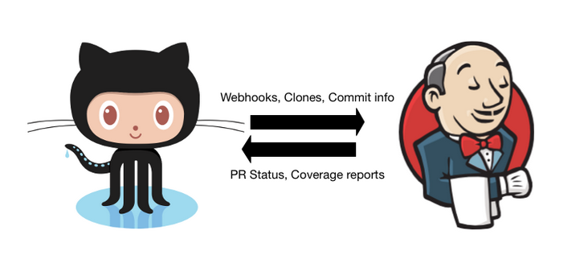

# Continuouse Integration with Jenkins and Github
- Author : [SeolHun](https://github.com/Seolhun/)

## Pre-Requirement
- Server(Ubuntu 16.04) : 다른 운영체제도 상관없지만 이번 포스트 내용은 Ubuntu 16.04를 기준으로 설명합니다.
- Jenkins

## Intro
현재 저희 지그재그는 CI(Continuouse Integration) 툴로 Jenkins를 사용하고 있습니다. Jenkins를 통해 Android, iOS, Server, Client 별, 빌드/테스트를 통해 버그를 줄이고자 노력하고 있습니다.
결론적으로, 지그재그 개발팀은 DevOps를 추구하지만 Jenkins를 통해 CI까지만 사용하는 이유는, 코드리뷰 및 UI 테스트처럼 직접 개발자가 리뷰/확인 해야하는 안정장치를 과정을 통해 배포를 하기 때문에 CI 툴을 통한 100% 자동화 CD(Continuouse Deploy)를 사용하지 않고 있습니다.

	CI와 CD(Delivery), CD(Deploy)의 차이점이 헷갈리신다면 아래 그림을 통해 쉽게 이해할 수 있습니다.
	

위 그림을 통해 이번 포스트와 가장 연관된 부분은 `Code`와 `Build` Process부분입니다.
현재 대부분이 Git을 통해 버전관리를 운영하고 있으며, Github를 통해 해당 코드들을 원격으로 저장/관리/통합하고 있습니다. 이 부분에서 중요한 것은 `Code`에 해당되는 내용은 Git과 Github에 해당된다는 것입니다. 엄밀히 보면 `Build`하는 과정부터가 Jenkins가 담당하는 부분인 것이죠. 그러므로, 해당 일련의 과정을 설명하기에 앞서, `Code > Build` 과정을 먼저 설명하는 것이 Jenkins를 설명하기에 더 좋은 순서가 될 것이라고 생각합니다.
이번 포스트를 통해 Jenkins - Github 설정방법을 통해 `Code > Build` 과정을 알아보도록 하겠습니다.

- 목표
	- Jenkins의 간단한 동작방식을 이해한다.
	- Jenkins와 Github를 연결을 통해 CI 흐름을 간단히 이해한다.

## Contents

#### 1. What is Jenkins.
- Jenkins란?
Jenkins는 대부분의 개발 작업을 
젠킨스는 다른 일상적인 개발 작업을 자동화할 뿐 아니라 파이프라인(Pipeline)을 사용해 거의 모든 언어의 조합과 소스코드 리포지토리에 대한 지속적인 통합과 지속적인 전달 환경을 구축하기 위한 간단한 방법을 제공한다.
젠킨스가 각각의 단계에 대한 스크립트 작성의 필요성을 없애주지는 않지만, 사용자가 쉽게 구축할 수 있는 것보다 더 빠르고 더 강력하게 빌드(Build), 테스트, 그리고 배포(deployment) 도구 등 체인 전체를 통합할 수 있는 방법을 제공해 준다.

- 특징
    - 쉬운 설치 : `java -jar jenkins.war`, `brew`, `apt-get`, `yum` 등 다양한 운영체제에서 손쉽게 설치 할 수 있으며 추가적인 데이터베이스 설치도 필요없습니다.
    - 쉬운 설정 : GUI를 통해 손 쉬운 설정을 할 수 있습니다.
    - 풍부한 플러그인 : Jenkins integrates with virtually every SCM or build tool that exists. [Jenkins plugins](https://wiki.jenkins.io/display/JENKINS/Plugins)
    - 확장성 : Jenkins는 확장 및 수정할 수 있으며, 새로운 플러그인을 통해 커스텀하여 사용할 수 있습니다.
    - 분산 빌드 시스템 : Jenkins는 운영체제 상관없이 빌드/테스트 서버를 여러대로 나누어 운영할 수 있습니다.

#### 2. How to Install Jenkins.
Jenkins를 구동시키기 위해서는 Jenkins가 설치되어있는 서버가 필요합니다.
Jenkins 설치와 관련한 내용은 잘 정리되어 있는 글이 많기에 추가적으로 작성하지는 않았습니다. 설치가 필요하신 분들은 아래 링크를 통해 Jenkins를 설치하시기 바랍니다.
- [How to Install Jenkins on Ubuntu 16.04](https://www.digitalocean.com/community/tutorials/how-to-install-jenkins-on-ubuntu-16-04)

#### 3. How to connect with Github
1. Build Integration
	- Github Plugin
2. Authenticating with Github
	- 

#### 4. How to connect with Private & Enterprise Repository in Github
1. SSH
2. Oauth Token

#### 5. Etc.
1. Pipeline
	- 간단한 pipeline 예제
	- 다음 jenkins blog로 예정
2. Jenkins Blue Ocean
	- 
3. Github Plugins

## References
- [Jenkins](https://jenkins.io/)
- [Jenkins Blue Ocean](https://jenkins.io/projects/blueocean/)
- [Jenkins with Github](https://jenkins.io/solutions/github/)
- [Continuouse Integration vs Continuouse Delivery](https://www.atlassian.com/continuous-delivery/ci-vs-ci-vs-cd)
- [Meet Jenkins Wiki](https://wiki.jenkins.io/display/JENKINS/Meet+Jenkins)
- [What is Jenkins from InfoWorld](https://www.infoworld.com/article/3239666/devops/what-is-jenkins-the-ci-server-explained.html)
