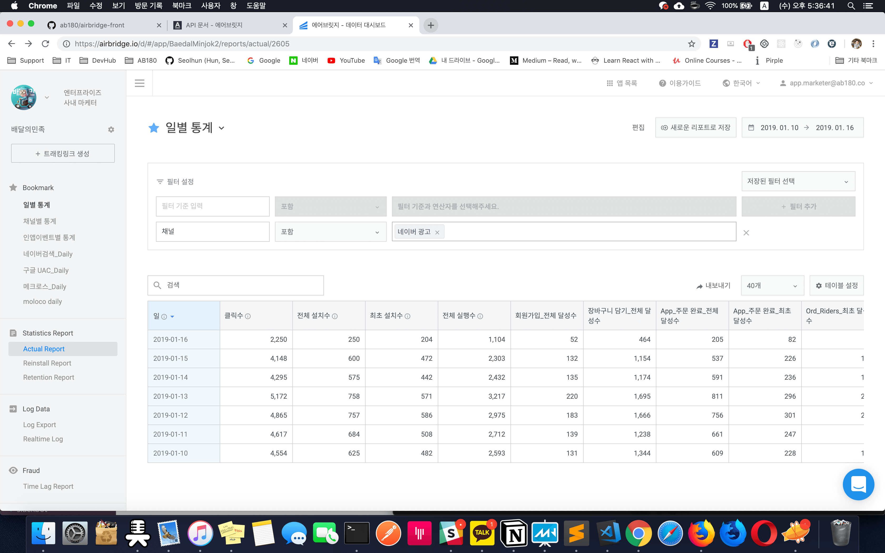
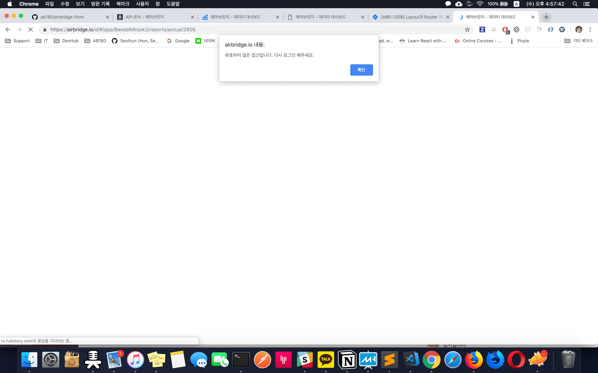
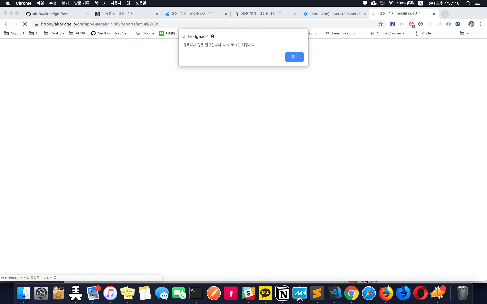
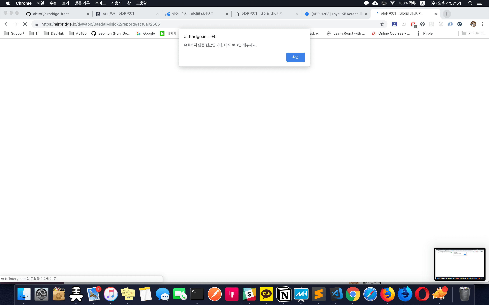
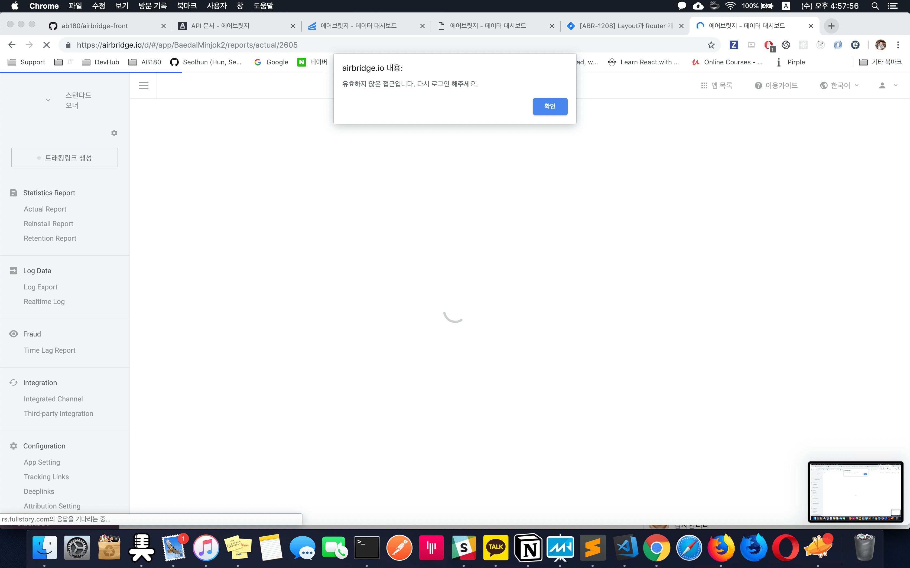
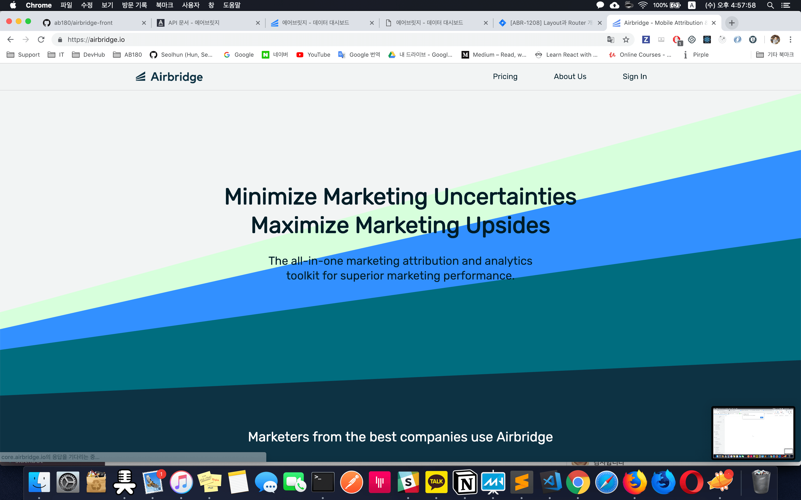

# React Router (ABR-1208/ABR-1210)
- React router v3 > v4 Migration
- Landing Auth Migration Into Airbridge Front
- Applying HoC Pattern on Router

## References
- [Task Tickets - Jira](https://teamab180.atlassian.net/browse/ABR-1208)
- [Router Structure - SpreadSheet](https://docs.google.com/spreadsheets/d/1dwiO4Rz6CwedhUIyRqaBE2nCJ4dKOOe7M4jP7UKc9QY)
- [Release Docs - SpreadSheet](https://docs.google.com/spreadsheets/u/1/d/1jlf01hdKmcwRTGBQ09KFTTZlsiGls149nFeZYObKTus/edit?usp=sheets_web)
- [Airbridge Front - Surge](http://airbridge-abr-1208.surge.sh)

---
## Purpose

1. React Router와 Layout 구조 분리하기
2. Layout의 구조를 분리하여 각각 기능에 따른 Container(HoC)로 운영하기.
3. HoC를 이용한 Data Rendering Hierarch 구성하기
4. redirect, alert 헬 해결하기. > Product 내에 controll 되지 않는 기능 문제 해결 (airbridge-landing)

---
## Why

### 1. Hierarchy Issues
현재 우리 구조는 `Authentication > Apps > DashBoard` 구조로 계층 별 필요한 권한과 데이터를 사전에 확인해야 함.

> Authentication이 분리되어 이를 처리한 로직이 복잡해지고, 데이터 비동기 처리와 View 우선순위(HoC 패턴)가 고려된 구조가 아니었던것이 문제.

1. 간단한 예로, 현재 `앱 > 대시보드 과정에서 필요한 데이터가 대시보드 랜더링 전에 로드되지 않음. 혹은 코드 구조상 중간에 업데이트 되는 현상이 발생 됨`
	- 즉, 대시보드에 필요한 데이터가 로딩 전, 관련 기반사항은 사전에 모두 충족한 조건이어야 함.
		- 이는 추가로 아래 2번에서 다룰 예정.
	- Async Sequnece 문제가 복잡하게 엮여있기도 함. 이는 차후 To Do List에서 언급
2. Layout container를 공통으로 사용하여 Layout container 안에 해당 Hierarchy를 분리하기 위한 로직이 복잡하게 존재.
3. 즉, 이러한 몇 안되는 조건을 분기하는 것에 대한 어려움이 있고, 이러한 것이 Layout을 Re-rendering을 시켜, 하위 Component에게도 영향을 미침

#### What is Hierarchy Problemns?
1. 
2. 

### 2. Re-Rendering Issues
과거 Layout에서 Layout과 Views의 새로운 데이터가 같이 dispatch 될 때마다 내부에 있는 Router가 연쇄적으로 Re-render가 발생되는 현상이 발생.

- Layout > HoC > View 구조로 데이터가 호출되지 않아, View 데이터 과정 중 Layout이 완료되는 등의 문제가 발생 됨.
- 코드로 보면, 이전 Layout의 `React.createElement(children, property)`의 코드에서 property의 값이 먼저 변하지 않으면, Router가 랜더링 된 이후 다시 Layout의 값이 변이되어 짧게나마 재랜더링이 되는 문제가 발생되던 것.
	- 즉, Hierarchy의 문제를 좀 더 Detail하게 알아 보는 것일뿐.


### 3. Alert Hell. Redirect Hell Issues
Landing에서 SignUp/In을 해결하고 이를 Airbridge로 redirect 시키는 문제.

1. 유효하지 않은 유저를 Landing으로 보내야 함
2. 유효하지 않은 경우 alert로 경고를 보내기에 해당 Route의 업데이트 간 경고창을 계속 보게 됨.
	> 유효성 검사 코드와 window.alert 문제
3. `Airbridge Product가 Authentication(SignIn/Up)으로 인해 Landing 프로덕트에 의존성이 생김.`

#### What is Alert Hell?
1. 
2. 
3. 
4. 
5. 
6. 

[](https://www.youtube.com/watch?v=VIJsEjEVPis) Video Label

<a href="http://www.youtube.com/watch?feature=player_embedded&v=VIJsEjEVPis
" target="_blank"></a>

---
## What to do

### - Prev
1. Layout
2. Router(routes)
	- callbackComponent
3. Layout

### - Current - [Router Structure - SpreadSheet](https://docs.google.com/spreadsheets/d/1dwiO4Rz6CwedhUIyRqaBE2nCJ4dKOOe7M4jP7UKc9QY)
1. Layout
2. CustomRoute(getFilteredRoutes)
3. Router(routes) - HoC
	- Authentication Route
	- Dashboard Route
4. Views

---
## Deep dive with the code.
#### 1. Hierarchy Issues
- Layout의 구조를 분리하여 각각의 Container따라 조건에 맞게 렌더링 시키기
	- 코드로 보면, 위아래 코드가 조건에 따라 랜더링을 다르게 함.
		```jsx
		// Hello, I'm not authorized client
		if (!isLogined) {
			return (
				<main id='authentication-layout'>
					<HashRouter>
						<Switch>
							{getFilteredRoutes({
								isLogined,
								displayedDepth: 1,
							}).map((route, idx) => (
								<Route
									key={`${`${route.path}-${idx}`}`}
									component={route.component}
									exact={route.exact}
									path={route.path}
									render={route.render}
								/>
							))}
						</Switch>
					</HashRouter>
				</main>
			);
		}

		return (
			// Hello, I'm authorized client
			<main id='ab180-layout'>
				<HashRouter>
					<section>
						<LayoutNav
							isLogined={isLogined}
							pathname={pathname}
							selectedApp={selectedApp}
							subdomain={subdomain}
						/>
						<Switch>
							{getFilteredRoutes({
								isLogined,
								displayedDepth: 2,
							}).map((route, idx) => (
								<Route
									key={`${`${route.path}-${idx}`}`}
									component={route.component}
									exact={route.exact}
									path={route.path}
									render={route.render}
								/>
							))}
						</Switch>
					</section>
				</HashRouter>
				<LayoutFooter />
			</main>
		);
		```
- 2 계층(Apps)에 대한 HoC 추가를 고민하는 중...

#### 2. Alert Hell. Redirect Hell Issues
- Alert(동기화 처리) 개선하기
- HoC Pattern 적용하기
	- Layout > Routes > Views
		```jsx
		// Component > Router > Render
		const renderAuthenticationRoute = RouteComponent => routeProps => (
			<AuthenticationRoute {...routeProps}>
				<RouteComponent {...routeProps} />
			</AuthenticationRoute>
		);

		const renderDashboardRoute = RouteComponent => routeProps => (
			<DashboardRoute {...routeProps}>
				<RouteComponent {...routeProps} />
			</DashboardRoute>
		);

		// Routes
		const routes = [
			/**
			* displayedDepthes: [1],
			*/
			buildRoute({
				path: '/email-recovery',
				render: renderAuthenticationRoute(SearchPasswordView),
				// displayedDepthes: [1], default values
			}),
			buildRoute({
				render: () => <Redirect to='/' />,
				displayedDepthes: [1],
			}),
			/**
			* displayedDepthes: [2],
			*/
			buildRoute({
				exact: true,
				path: '/app',
				render: renderDashboardRoute(HomePage),
				requireAuth: true,
				displayedDepthes: [2],
			}),
		];
		```

#### 3. Re-Rendering Issues
- React Router 앞에 HoC 구조를 둠으로써 해당 Views에 필요한 로직/데이터 분리하기
	- Layout > HoC > Views 구조에서 각각의 계층에 맞는 필요한 데이터를 HoC구조를 통해 해결
		```jsx
		// Dashboard Routes
		// Not dispatched required data
		if (selectedApp.isFetching) {
			return (
				<Spinner />
			);
		}

		return (
			<div className='layout-container'>
				{children}
			</div>
		);
		```
- 필요한 데이터를 가져오기 전에는 다음 계층으로 넘어가지 않는다.
	- 다음 계층을 보여주는 방법에 따라 코드는 조금 변할 수 있다.
---
## How to do (For FrontEnd)
1. View 구성
	- Components
	- Containers
2. Routes 추가
	- `displayedDeplth`를 고려할 것
	- HoC 내부의 다른 로직이 필요하면 `HoC Route`에 LifeCycle을 고려하여 추가
	- Depth의 추가로 다른 HoC Route가 필요하면 `DashboardRoute`와 같은 HoC Route 추가 작성
		- RouteHelperUtils 참고할 것.
		- Routes에 해당 Route 추가
3. Layout에 Routes 렌더링하기
	- Routes의 필터링 조건이 더 필요하면 Routes에 `getFilteredRoutes`함수에 변수 추가 선언
		- RouteHelperUtils에 `buildRoute` 함수와 연관되어 있으므로 추가 작성.
4. Layout에 조건에 맞게 작성하기.

---
## To do List (Not yet, need discussion)
1. 유효성 검사 페이지 개선하기 (Not-found, Error, Un-authorized)
	- 에러 관련 페이지 개선하기
2. HoC 더 잘 활용하기 : Data API와 Data구조 정리하기
	- [Router Structure - SpreadSheet](https://docs.google.com/spreadsheets/d/1dwiO4Rz6CwedhUIyRqaBE2nCJ4dKOOe7M4jP7UKc9QY)
3. Skeleton Rendering || Split Rendering으로 UI 개선하기
	- 기존 Action Redux Sequence 처리 로직 개선
	- Router Structure에 따른 필수 데이터를 가져오는 과정에서 UI/UX를 매끄럽게 보여주기 위함.
