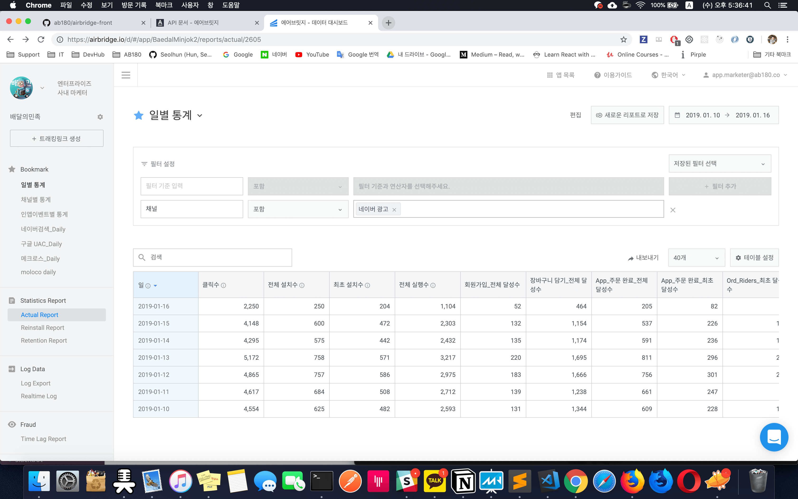
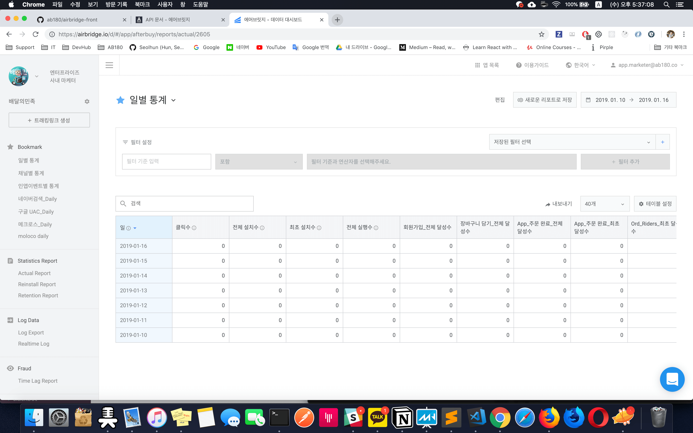
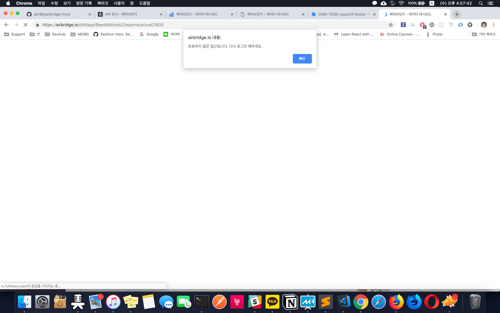
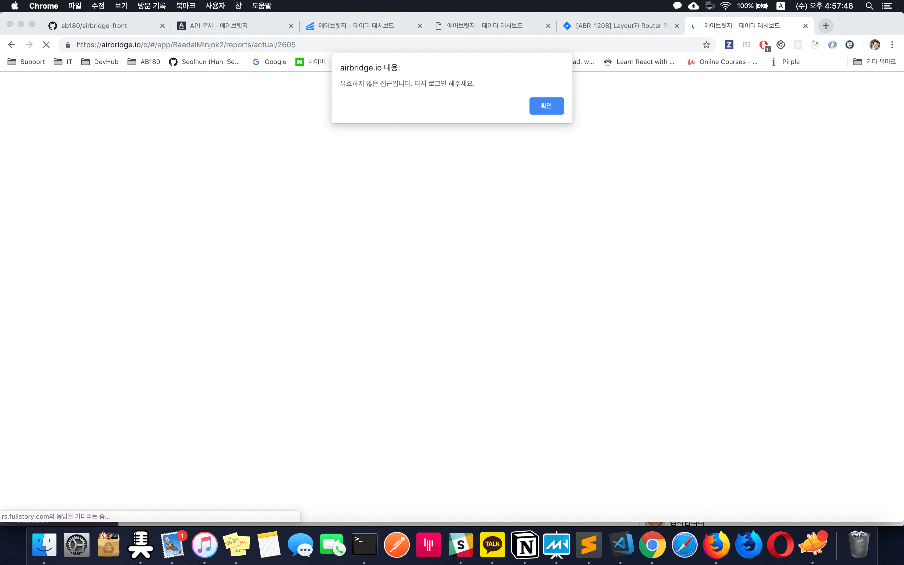
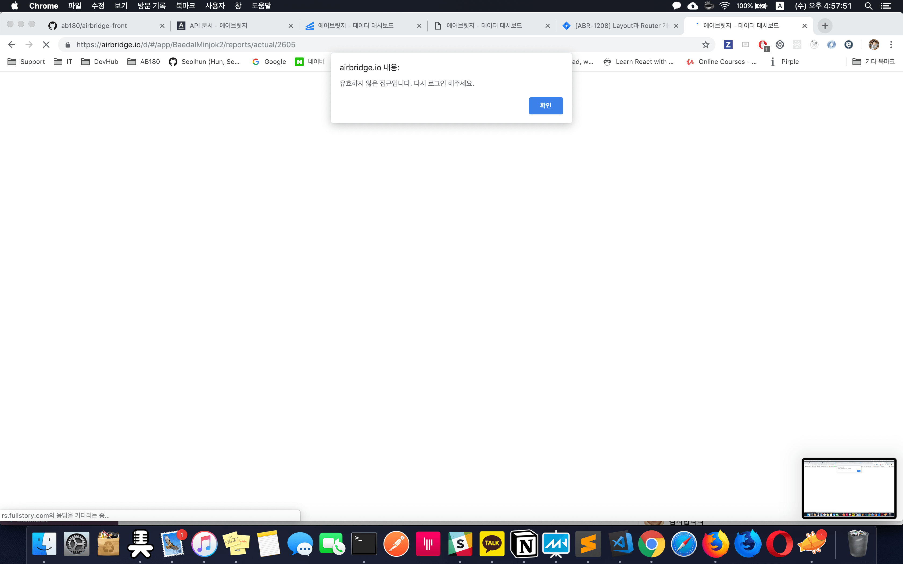
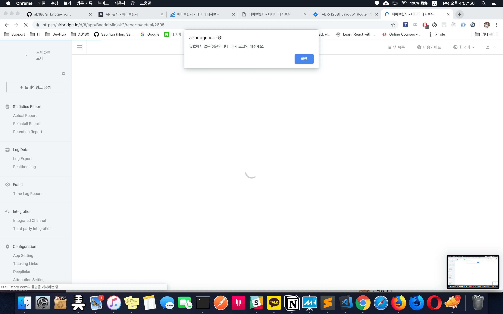
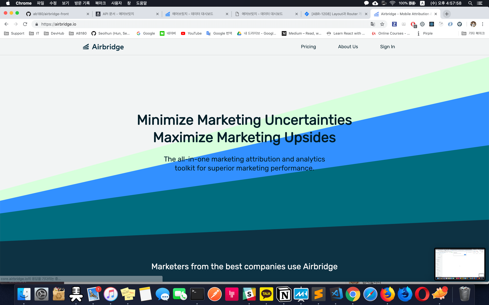

# React Router (ABR-1208/ABR-1210)
- React router v3 > v4 Migration
- Auth Migration from Landing to Airbridge-Front
- Applying HoC Pattern on Router

## References
- [Task Tickets - Jira](https://teamab180.atlassian.net/browse/ABR-1208)
- [Router Structure - SpreadSheet](https://docs.google.com/spreadsheets/d/1dwiO4Rz6CwedhUIyRqaBE2nCJ4dKOOe7M4jP7UKc9QY)
- [Release Docs - SpreadSheet](https://docs.google.com/spreadsheets/d/1jlf01hdKmcwRTGBQ09KFTTZlsiGls149nFeZYObKTus)
- [Airbridge Front - Surge](http://airbridge-abr-1208.surge.sh)

---

## Purpose

1. React Router를 이용하여 Layout 구조 및 로직 분리하기
	- Layout의 구조를 분리하여 각각 기능에 따른 HoC 함수로 재사용성 늘리기.
2. HoC를 이용한 Data Rendering Hierarch 구성하기.
	- Re-Rendering 이슈를 막고 필요한 데이터 검사하기.
3. redirect, alert 헬 해결하기. > Product 내에 controll 되지 않는 문제 해결하기.
4. Business(IAM)와 관련된 로직을 분기하여 처리할 수 있는 공간을 만드는 것.

---

## Why

### 1. Hierarchy Issues
현재 우리 구조는 `Authentication > Apps > DashBoard` 구조로 계층 별 필요한 권한과 데이터를 사전에 확인해야 함.

> Authentication이 랜딩에 위치되어 이를 처리하는 방법이 복잡하며, View 우선순위(HoC)가 고려된 구조가 아닌 문제가 존재.

1. 간단한 예로, 현재 `앱 > 대시보드 과정에서 필요한 데이터가 대시보드 랜더링 전에 로드되지 않음. 혹은 코드 구조상 중간에 업데이트 되는 현상이 발생 됨`
	- 즉, `대시보드에 필요한 데이터가 로딩 전, 관련 기반사항은 사전에 모두 충족한 조건이어야 하는데 그렇지 않음.`
		- 이는 추가로 아래 2번(Re-Rendering Issues)과 연관이 되어있므로,
	- Async Sequnece 문제가 복잡하게 엮여있기도 함. 이는 차후 To Do List에서 언급
2. 기존에는 Layout만을 사용하여, 각각의 View에 필요한 Hierarchy 분리 로직이 Layout에 복잡하게 존재
	- 로직의 복잡함(Layout)
	- 해당사항이 해당 View 도착 전에 Re-rendering 되어 속도를 늦추고, 하위 Container에게 영향을 미침

#### Ex) What is Hierarchy Problemns?
1. 
2. 

### 2. Re-Rendering Issues
과거 Layout에서 `Layout과 Views의 새로운 데이터가 dispatch 될 때마다 Layout 하위에 있는 Router가 연쇄적으로 Re-render가 발생되는 문제가 발생.`

- Layout > View 구조로서 View 랜더링 과정 중 Layout에서 사전에 완료되어야 하는데 그렇지 않은 문제가 존재.
	- 즉, Layout의 데이터가 View를 랜더링하는 중간에 완료되는 문제가 발생 됨.
- 코드로 보면, 이전 Layout의 `React.createElement(children, property)의 property의 값이 먼저 변화가 된 후에 Router가 랜더링 되어야하지만, 그렇지 않아. property 값이 변이되면 짧게나마 Re-Rendering 문제가 발생되던 것.

---

### 3. Alert Hell. Redirect Hell, Anyway Hell Issues
Landing에서 SignUp/In을 해결하고 이를 Airbridge로 redirect 시키는 문제.

1. 유효하지 않은 유저를 Landing으로 보내야 하는 문제
	- 그러는 동안 최대 6~7번의 alert번이나 마주함.
3. `Airbridge Product가 Authentication(SignIn/Up)으로 인해 Landing 프로덕트에 의존성이 생김.`
	- 만약, Landing에 문제가 생긴다면?

---

#### Ex) What is Alert Hell?
1. 
2. 
3. 
4. 
5. 
6. 

[](https://www.youtube.com/watch?v=VIJsEjEVPis)

---

## What to do

### - Prev
1. Layout
2. Router(Routes)
	- callbackComponent
3. Layout

### - Next - [Router Structure - SpreadSheet](https://docs.google.com/spreadsheets/d/1dwiO4Rz6CwedhUIyRqaBE2nCJ4dKOOe7M4jP7UKc9QY)
1. Layout
2. CustomRoute(getFilteredRoutes)
3. Router(routes) - HoC
	- Authentication Route
		- Token이 없는 경우
		- Token이 있는데 만료된 경우(토큰이 유효하지 않은 경우)
			- 악의적인 경우
	- Dashboard Route
		- App에 접근권한이 유효한지에 대한 체크
		- ...
4. Views

---
## Deep dive with the code.
#### 1. Hierarchy Issues
- Layout의 구조를 분리하여 각각의 Container따라 조건에 맞게 렌더링 시키기
	- 코드로 보면, 위아래 코드가 조건에 따라 랜더링을 다르게 함.
		```jsx
			if (!isLogined) {
				return (
					<main id='authentication-layout'>
						<div className='authentication-container'>
							<HashRouter>
								<Switch>
									{getFilteredRoutes({
										isLogined,
										displayedDepth: 1,
									}).map((route, idx) => (
										<Route
											key={`${`${route.path}-${idx}`}`}
											component={route.component}
											exact={route.exact}
											path={route.path}
											render={route.render}
										/>
									))}
								</Switch>
							</HashRouter>
						</div>
					</main>
				);
			}

			return (
				<main id='ab180-layout'>
					<HashRouter>
						<Switch>
							{getFilteredRoutes({
								isLogined,
								displayedDepth: 2,
							}).map((route, idx) => (
								<Route
									key={`${`${route.path}-${idx}`}`}
									component={route.component}
									exact={route.exact}
									path={route.path}
									render={route.render}
								/>
							))}
						</Switch>
					</HashRouter>
					<LayoutFooter />
				</main>
			);
		```
- 2 계층(Apps)에 대한 HoC 추가를 고민하는 중...

#### 2. Alert Hell. Redirect Hell Issues
- Alert(동기화 처리) 개선하기
- HoC Pattern 적용하기
	- Layout > HoC > Views
		```jsx
		// Routes
		const routes = [
			/**
			* displayedDepthes: [1],
			*/
		  buildRoute({
		    exact: true,
		    path: '/',
		    component: SignInView,
		  }),
		  buildRoute({
		    path: '/signup',
		    component: SignUpView,
		  }),
			/**
			* displayedDepthes: [2], HoC
			*/
		  buildRoute({
		    exact: true,
		    path: '/myinfo',
		    component: withAuthenticationRoute(withDashboardRoute(MyInfoPage)())(),
		    requireAuth: true,
		    displayedDepthes: [2],
		  }),
		];
		```

#### 3. Re-Rendering Issues
- React Router 앞에 HoC 구조를 둠으로써 해당 Views에 필요한 로직/데이터 분리하기
	- Layout > HoC > Views 구조에서 각각의 계층에 맞는 필요한 데이터를 HoC구조를 통해 해결
		```jsx
		// Orderized 1
		if (me.hasError) {
			return (
				<NotFoundView />
			);
		}

		// Orderized 2
		if ((me.isFetching || !me.response.email)) {
			return (
				<Spinner />
			);
		}

		// Orderized 3
		return (
			<RouteComponent
				{...this.props}
			/>
		);
		```
- 필요한 데이터를 가져오기 전에는 다음 계층으로 넘어가지 않는다.
	- 다음 계층을 보여주는 방법에 따라 코드는 조금 변할 수 있다.

---

## To do List (Not yet, but, Need discussion)
#### In Progress
1. 유효성 검사 페이지 개선하기 (Not-found, Error, Un-authorized)
	- 에러 관련 페이지 개선하기
2. 비밀번호찾기(ResetPassword)에 전송되는 Token 이메일 수정하기.

#### Pending
1. 서비스 이용약관, 개인정보 취급방침 개선 - Landing에서 다른 작업으로 진행.
	- https://airbridge.io/terms-of-service.html
	- https://airbridge.io/privacy-policy.html
2. HoC 더 잘 활용하기 : Data API와 Data구조 정리하기 (BusinessModel과 연관있음)
	- [Router Structure - SpreadSheet](https://docs.google.com/spreadsheets/d/1dwiO4Rz6CwedhUIyRqaBE2nCJ4dKOOe7M4jP7UKc9QY)
3. Skeleton Rendering || Split Rendering으로 UI 개선하기
	- 기존 Action Redux Sequence 처리 로직 개선
	- Router Structure에 따른 필수 데이터를 가져오는 과정에서 UI/UX를 매끄럽게 보여주기 위함.
---

## How to do (For FrontEnd)
1. View 구성
	- Components
	- Containers
2. Routes 추가
	- `displayedDeplth`를 고려할 것
	- HoC 내부의 다른 로직이 필요하면 `HoC Route`에 LifeCycle을 고려하여 추가
	- Depth의 추가로 다른 HoC Route가 필요하면 `DashboardRoute`와 같은 HoC Route 추가 작성
		- RouteHelperUtils 참고할 것.
		- Routes에 해당 Route 추가
3. Layout에 Routes 렌더링하기
	- Routes의 필터링 조건이 더 필요하면 Routes에 `getFilteredRoutes`함수에 변수 추가 선언
		- RouteHelperUtils에 `buildRoute` 함수와 연관되어 있으므로 추가 작성.
4. Layout에 조건에 맞게 작성하기.
