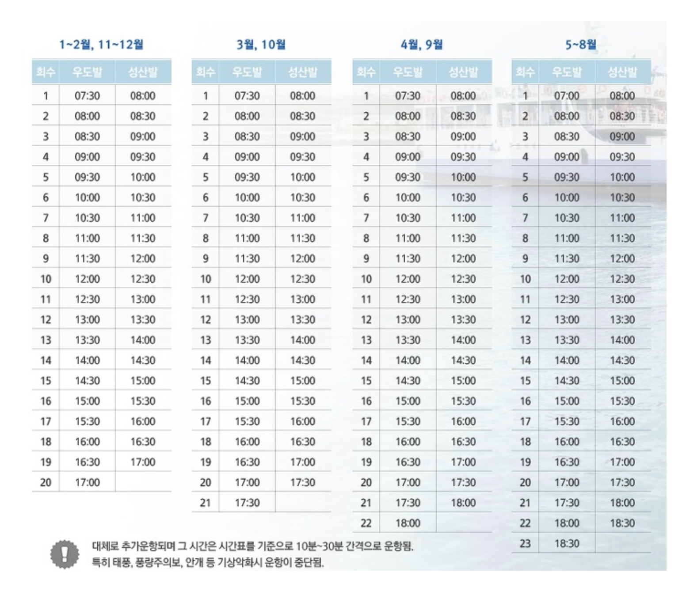
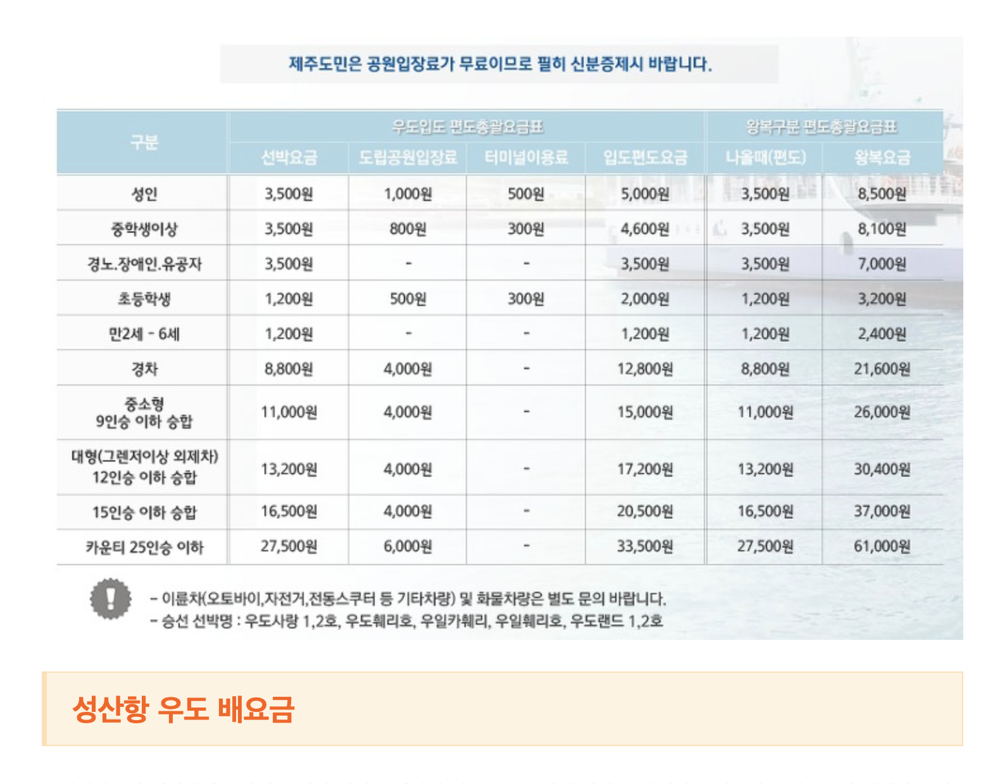

# Jeju Trip

- Periods: 2019.10.06 ~ 2019.10.09 

---

## 6일

### - 비행기
16시 55분 출발 ~ 18시 05분 도착

### - 렌트카
- 대합실 옆 3-13번 구역에서
- AJ렌터카 셔틀버스 탑승 후 지점이동

### - 할 일
- 동문수산시장
	- 방어회, 고등어회, 딱새우
		- 올레회집
                - 돌하르방 회집

### - 숙소
- 제주 리젠트마린 호텔

---

## 7일

### - 할 일
- 유달산 식당
    - 오분자기 뚝배기
    - 전복죽
- 함덕서우봉 해변
- 월정리 해변
	- 테라스 카페
- 곰막 식당
    - 성게국수
    - 고등어 회
- 성산항
	- 1인 8500원 왕복
	- 1시간 간격으로 배 출발
		- 최대 14시 30분 도착
- 우도
	- 전기자전거
	- 18시 30분이 마지막 복귀 배	

### - 숙소

썬라이즈 호텔

---

## 8일

### - 할 일
- 성산일출봉
	- 일출
- 조식
    - 썬라이즈 호텔
- 섭지코지
- 쇠소깍
	- 카약
- 천지연 폭포
- 오돈가/기운네흑돼지

### - 숙소

파크 선샤인 호텔

---

## 9일
- 외돌개
- 1100고지
	- 공항가는 길에 가기
- 새별오름/새빌카페
- 용두암

### - 렌트카
- 반납
- 버스타고 공항

### - 비행기
18시 40분 출발 ~ 19시 50분 도착

--- 

## Ref Images

### - 2019년 기준
#### 우도 TimeTable

---

## 준비물

- 충전기
- 보조배터리
- 우비
- 속옷
- 옷
- 양말
- 보조가방
- 우산
- 지갑(+현금)
- 츄리닝
- 비닐봉지
- 삼각대
- 치약
- 칫솔
